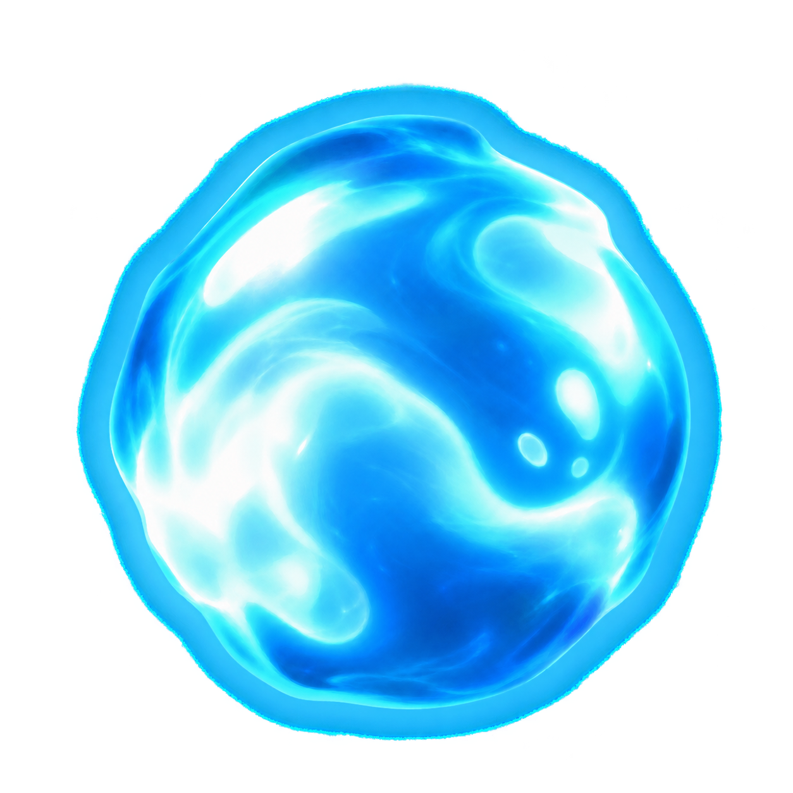

  
  <h1>MojoRecomp</h1>
  
Native Windows ports of the Crash Bandicoot Titans games.

  

    
    
    
    
  

> [!IMPORTANT]
> MojoRecomp does not include the original game. You must provide your own legally obtained Xbox 360 copy of **Crash of the Titans**.

## About

MojoRecomp is an unofficial native Windows PC port project for the Crash Bandicoot Titans games. It recompiles the Xbox 360 game code to run through its own PC runtime; it is not an Xbox 360 emulator.

| Component | Version | Status |
| --- | --- | --- |
| MojoRecomp Launcher | `1.1.0` | Pre-release |
| Crash of the Titans | `0.2.0-alpha` | Playable |
| Crash: Mind Over Mutant | `0.0.0-dev` | In development (Not Playable Yet!) |

## Requirements

- 64-bit Windows 10 or Windows 11
- A Vulkan 1.3 capable GPU with a current driver
- Microsoft Edge WebView2 Runtime (normally already installed on updated Windows 10/11 systems)
- A legally obtained Xbox 360 **Crash of the Titans** ISO
- A controller is recommended, but keyboard is supported

The launcher/runtime include their required application libraries. You do not need to install the Visual C++ Redistributable, a separate DirectX runtime, the Vulkan SDK, or development tools just to play.

### Platform support

| Platform | Status | Notes |
| --- | --- | --- |
| Windows 10/11 x64 | ✅ Supported | Official release target |
| Windows on ARM64 | ❌ Not available | No native ARM64 build |
| Windows 32-bit | ❌ Unsupported | A 64-bit host is required |
| Linux | ❌ Not available | Launcher and runtime are not ported |

No other platform ports are currently announced.

## Quick start

1. Download and open the **MojoRecomp Launcher**.
2. Choose where your `MojoRecomp-Games` library will be stored.
3. Select **Crash of the Titans**, open **Versions**, and install the latest compatible runtime.
4. Return to **Overview**, click **SET UP**, and select your Xbox 360 `.iso`.
5. Wait for setup to finish, then click **PLAY**.
6. The first time you play, choose the game language. You can change it later in **Game Settings**.

The ISO is only used during setup and is never modified. Once the game is installed, you do not need to import it again.

If the runtime offers optional Localization Pack content during installation, you can install it then or choose **Runtime only** and add it later.

## Languages

| Language | Source |
| --- | --- |
| English | Original game |
| German | Original game |
| French | Original game |
| Spanish | Original game |
| Italian | Original game |
| Dutch | Original game |
| Brazilian Portuguese | MojoRecomp Localization Pack |

## Game settings

The default profile is designed to stay close to the original game while improving image quality:

| Setting | Default |
| --- | --- |
| Display mode | Windowed |
| Resolution | Native 720p (1x) |
| Aspect ratio | 16:9 |
| VSync | Off |
| Anti-aliasing | FXAA Extreme |
| Texture filtering | 8x |
| Frame rate | 30 FPS |
| Logging | On |

Other resolutions and aspect ratios are available in **Game Settings**. The **30+ FPS** mode is experimental. Unsupported texture-filtering levels are disabled automatically.

Discord activity is enabled by default and can be changed in **Launcher Settings**.

## Updates

The launcher checks for its own updates automatically. Runtime updates stay under your control in **Versions** and are never installed silently when you press **SET UP** or **PLAY**.

For offline installs, use **Versions > Install Runtime from ZIP** or **Game Settings > Install Pack from ZIP**. A game that is already installed with a valid runtime can still be played offline.

## Controls

Two local players are supported. Controller 1 maps to Player 1 and Controller 2 to Player 2. Keyboard and controller can be used together, and input is ignored while the game window is unfocused.

<strong>Keyboard controls</strong>

| Xbox control | Player 1 | Player 2 |
| --- | --- | --- |
| Left stick | `W` `A` `S` `D` | `I` `J` `K` `L` |
| Right stick | Arrow keys | `Right Ctrl` + `I` `J` `K` `L` |
| D-pad | `Left Shift` + Arrow keys | `Right Shift` + `I` `J` `K` `L` |
| A | `F` or `Space` | `O` |
| B | `G` | `P` |
| X | `R` | `U` |
| Y | `T` | `Y` |
| LB / RB | `Q` / `E` | `H` / `;` |
| LT / RT | `Z` / `C` | `N` / `M` |
| LS / RS | `X` / `V` | `,` / `.` |
| Start / Back | `Enter` / `Tab` | `]` / `[` |

<strong>Debug shortcuts</strong>

| Key | Action |
| --- | --- |
| `F1` × 10 | Toggle Debug Mode |
| `F2` | Unlock all moves |
| `F3` | Toggle 4x fast-forward |
| `F4` | Unlock all episodes |
| `F6` | Pause or resume |
| `F7` | Advance one frame while paused |
| `F9` | Toggle the performance overlay |

`F2`, `F3`, `F4`, `F6`, and `F7` require Debug Mode. Unlock shortcuts change save progress, so back up your save first.

## Storage

| Data | Location |
| --- | --- |
| Game library | `%USERPROFILE%\Games\MojoRecomp-Games\` by default, or the folder you choose |
| Saves | `%USERPROFILE%\Saved Games\MojoRecomp\cot\` |
| Settings, logs and support files | `%LOCALAPPDATA%\MojoRecomp\` |

You can move the game library later from **Launcher Settings**. The launcher verifies the move before switching locations, and saves remain separate.

## Troubleshooting

If the game does not start or graphics look wrong:

- Update your GPU driver and confirm it supports Vulkan 1.3.
- Make sure Microsoft Edge WebView2 Runtime is installed if the launcher itself does not open correctly.
- OBS/Streamlabs Vulkan hooks can interfere with startup on some systems; use **Window Capture** or **Display Capture** if needed.
- Open **Help** in the launcher and create a **Support Package** before reporting a problem.

Support Packages include logs and technical diagnostics, but exclude saves, ISOs, and extracted game assets. Minidumps are optional and are never uploaded automatically.

## Acknowledgements

MojoRecomp builds on work from the following projects and their contributors:

- [ReXGlue](https://github.com/rexglue/rexglue-sdk)
- [XenonRecomp](https://github.com/hedge-dev/XenonRecomp)
- [XenosRecomp](https://github.com/hedge-dev/XenosRecomp)
- [Tauri](https://github.com/tauri-apps/tauri), [Svelte](https://github.com/sveltejs/svelte), and Rust
- [SDL](https://github.com/libsdl-org/SDL)
- [FFmpeg](https://github.com/FFmpeg/FFmpeg)
- [LLVM](https://github.com/llvm/llvm-project) and [DirectXShaderCompiler](https://github.com/microsoft/DirectXShaderCompiler)
- [Vulkan-Headers](https://github.com/KhronosGroup/Vulkan-Headers)
- [XboxDev/extract-xiso](https://github.com/XboxDev/extract-xiso)
- `{fmt}`, `toml++`, SIMDe, libmspack, TinySHA1, tiny-AES-c, xxHash, and launcher dependencies

Exact versions and license texts are listed in [Third-Party Notices](launcher/resources/THIRD_PARTY_NOTICES.md). Artwork sources are recorded in [Launcher Artwork Sources](launcher/public/art/SOURCES.md).

## AI usage

AI tools have been used to assist with research, repetitive implementation work, debugging, tests, build automation, and documentation drafts. Project changes remain subject to human review and testing.

## Legal

MojoRecomp is an unofficial fan project for research and preservation. It is not affiliated with or endorsed by Activision, Microsoft, Radical Entertainment, Sierra Entertainment, or any other rights holder.

Original MojoRecomp code is available under the [ISC License](LICENSE) unless a file states otherwise. Third-party software keeps its own license. The ISC License does not cover original game code or data, generated guest code, ISOs, XEX files, videos, audio, textures, saves, names, characters, logos, or artwork.

Crash Bandicoot, Crash of the Titans, Crash: Mind Over Mutant, and related material belong to their respective owners. Users must provide their own legally obtained supported game copy.
